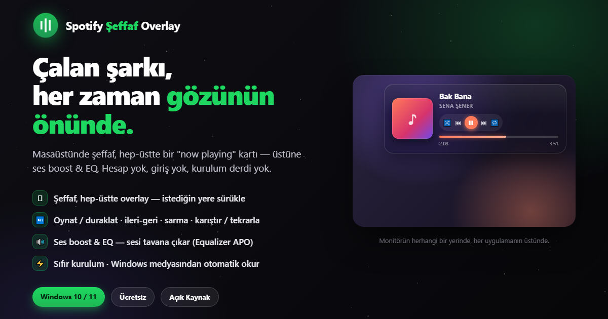

<div align="center">

# 🎵 Spotify Şeffaf Overlay

**Çalan şarkı, her zaman gözünün önünde.**

Masaüstünde şeffaf, hep-üstte bir "now playing" kartı — oynatma kontrolleri, ses boost & EQ dahil.
Hesap yok, giriş yok, kurulum derdi yok.

[](https://github.com/DarkCreative1/SpotifyWidget/releases)
[](https://www.electronjs.org/)
[](LICENSE)
[](https://github.com/DarkCreative1/SpotifyWidget)

<br />



</div>

<br />

## ✨ Özellikler

| Özellik | Açıklama |
|---|---|
| 🪟 **Şeffaf Overlay** | Hep-üstte, sürüklenebilir kart — istediğin yere taşı |
| ▶️ **Oynatma Kontrolleri** | Oynat · Duraklat · İleri · Geri · Karıştır · Tekrarla |
| 🔊 **Ses Kontrolü** | Spotify ses seviyesini doğrudan overlay üzerinden ayarla |
| 🎨 **Dinamik Tema** | Albüm kapağından otomatik renk çıkarma & arka plan parıltısı |
| 🎛️ **Ses Boost & EQ** | Equalizer APO entegrasyonu ile güçlendirilmiş ses deneyimi |
| ⚙️ **Ayarlar Paneli** | Boyut, opaklık, tema rengi, visualizer ve başlangıç davranışını özelleştir |
| ⌨️ **Kısayol Tuşları** | Medya kontrolleri için global klavye kısayolları |
| 📌 **Akıllı Konumlandırma** | Ekran kenarlarına yapışma & çoklu monitör desteği |

<br />

## 🚀 Kurulum

### Hazır Çalıştırılabilir (Önerilen)

[**📥 Releases**](https://github.com/DarkCreative1/SpotifyWidget/releases) sayfasından en son sürümü indir ve çalıştır — başka bir şeye gerek yok.

### Kaynak Koddan Derleme

```bash
# 1. Repoyu klonla
git clone https://github.com/DarkCreative1/SpotifyWidget.git
cd SpotifyWidget

# 2. Bağımlılıkları yükle
npm install

# 3. Geliştirme modunda çalıştır
npm run dev

# 4. Portable .exe oluştur
npm run build
```

<br />

## 📋 Gereksinimler

| Gereksinim | Detay |
|---|---|
| **İşletim Sistemi** | Windows 10 / 11 |
| **Node.js** | v18 veya üzeri (sadece kaynak koddan derleme için) |
| **Spotify** | Masaüstü uygulaması yüklü ve çalışır durumda |
| **Equalizer APO** | *(İsteğe bağlı)* Ses boost & EQ özellikleri için |

<br />

## ⚙️ Yapılandırma

System tray ikonuna **sağ tık** yaparak ayarlar panelini aç. Buradan özelleştirebileceğin seçenekler:

- 🎚️ **Overlay boyutu** — ölçek faktörü (0.7× – 1.8×)
- 🎨 **Tema & opaklık** — renk paleti ve şeffaflık seviyesi
- 🔈 **Ses boost** — Equalizer APO ile ses güçlendirme
- 🚀 **Başlangıçta çalıştır** — Windows ile birlikte otomatik başlat

<br />

## 🏗️ Proje Yapısı

```
spotify-transparent-overlay/
├── assets/                  # İkonlar & tanıtım görselleri
│   ├── icon.png
│   ├── tray.png
│   └── promo.png
├── src/
│   ├── main/                # Electron ana süreç
│   │   ├── main.js          # Uygulama giriş noktası & pencere yönetimi
│   │   ├── nowPlaying.js    # SMTC ile çalan şarkı bilgisi
│   │   ├── mediaControl.js  # Medya kontrol komutları
│   │   ├── volumeControl.js # Ses seviyesi yönetimi
│   │   ├── apoController.js # Equalizer APO entegrasyonu
│   │   └── store.js         # Kalıcı ayar deposu
│   ├── preload/             # Electron preload scriptleri
│   └── renderer/            # Kullanıcı arayüzü
│       ├── overlay.html     # Ana overlay kartı
│       ├── overlay.css
│       ├── overlay.js
│       ├── settings.html    # Ayarlar penceresi
│       ├── settings.css
│       └── settings.js
├── package.json
├── LICENSE                  # GPL-3.0
└── README.md
```

<br />

## 🛠️ Kullanılan Teknolojiler

<div align="center">


</div>

- **Electron** — Çapraz platform masaüstü uygulama çatısı
- **Windows SMTC** — Sistem medya bilgilerini okuma (`@coooookies/windows-smtc-monitor`)
- **PowerShell** — Sistem seviyesinde medya ve ses kontrolü
- **Equalizer APO** — Gelişmiş ses işleme & boost

<br />

## 🤝 Katkıda Bulunma

Katkılarınız memnuniyetle karşılanır! Bir hata bulduysan veya yeni bir özellik önereceksen:

1. Bu repoyu **fork** et
2. Yeni bir branch oluştur (`git checkout -b ozellik/harika-ozellik`)
3. Değişikliklerini commit et (`git commit -m 'Harika özellik eklendi'`)
4. Branch'i push et (`git push origin ozellik/harika-ozellik`)
5. Bir **Pull Request** aç

<br />

## 📄 Lisans

Bu proje [**GNU General Public License v3.0**](LICENSE) ile lisanslanmıştır. Detaylar için `LICENSE` dosyasına bakın.

<br />

---

<div align="center">

**⭐ Projeyi beğendiysen yıldız vermeyi unutma!**

<sub>Made with ❤️ by <a href="https://github.com/DarkCreative1">dark</a></sub>

</div>
